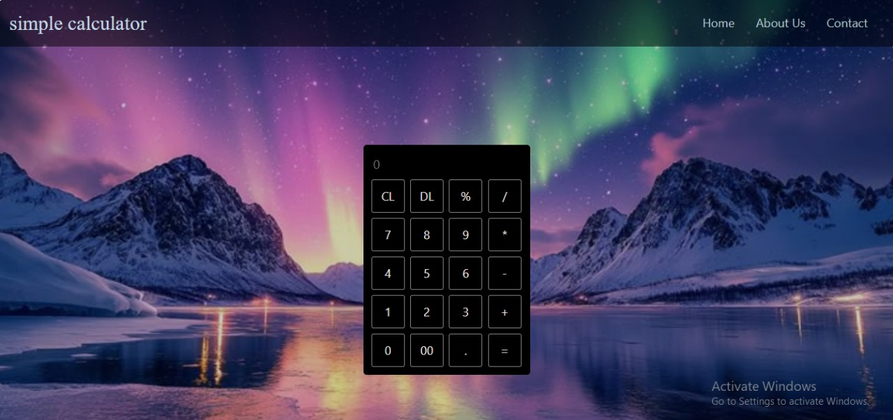

# Simple Calculator 🧮

A simple calculator web application built using **HTML**, **CSS**, **JavaScript**, and **Bootstrap**.  
This project was developed as a **JavaScript task for SEF Academy** to practice JavaScript logic and DOM manipulation.

---

## 📸 Project Screenshot


---

## 📌 Task Description
The goal of this task is to build a functional calculator using **JavaScript** for logic and **Bootstrap** for UI styling.  
No JavaScript frameworks were used.

---

## ✨ Features
- Basic arithmetic operations:
  - Addition (+)
  - Subtraction (−)
  - Multiplication (*)
  - Division (/)
  - Percentage (%)
- Clear all input (CL)
- Delete last digit (DL)
- Decimal numbers support
- Responsive design using Bootstrap

---

## 🛠️ Technologies Used
- HTML5  
- CSS3  
- Bootstrap  
- JavaScript 

---

## 🎯 Learning Objectives
- Practice JavaScript logic
- DOM manipulation
- Event handling
- Using Bootstrap for responsive UI

---

## 🚀 How to Run
1. Clone the repository:
   ```bash
   git clone https://github.com/your-username/simple-calculator.git
